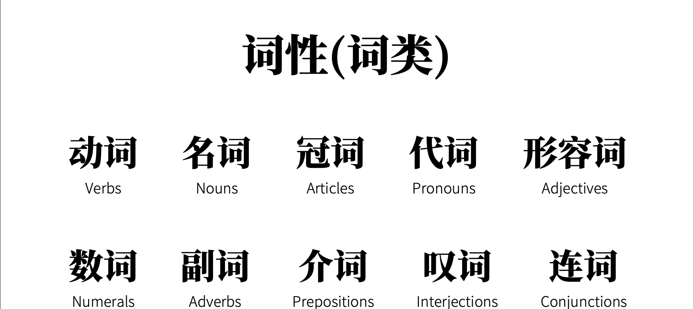

## 简单句
### 五大基本句型
可以这样认为，英语中最基本的句子成分为：

> Subject/主语 + Predicate/谓语

让我们把目光焦距在Predicate上，谓语表示了一种动作，就是语法上的**动词/Verbs**。

根据动词的来分类，可以将基本的句子分为**5种基本句型**。

1. 可以独立完成的动词：*主语（subject） + 不及物动词（intransitive verbs）*。

2. 有一个承受对象的动词： *主语 + 及物动词（transitive verbs） + 宾语（object）*。
3. 有两个动作承受者： *动词 + 双及物动词（ditransitive verbs） + 直接宾语（direct object）+ 简介宾语（indirect object）*。
4. 只有一个动作承受者：*主语 + 复杂动词（complex-transitive verbs） + 宾语 + 宾补 （object implement）*。
5. 系动词，将表语和主语联系在一起：*主语 + 系动词（linking verbs） + 表语/主语补语*。

上述提到了几种句子成分（Clause Elements）
1. 主语
2. 谓语
3. 宾语
4. 宾语补语
5. 主语补语
6. 定语 Attribute
7. 状语 Adverbial
8. 同位语 appositive

一个相同的句子成分可能有不同词性的单词组成，英语中的词性如图列出。

## 谓语动词的attributes
### 动作时间（Tense）和动作状态 （Aspect）
动作时间分为现在、过去、将来、 过去将来。动作状态分为一般状态，进行状态，完成状态和完成进行状态。
这两种状态两两组合，一共有16种分类，语法如下图所示。
| 时间/状态 | 现在 | 过去 | 将来 | 过去将来 |
| ---- | ---- | ---- | ---- | ---- |
| 一般 | do；dose | did | will do；be going to | would do   
| 进行 | be doing | was/were doing | will be doing | would be doing
| 完成 | have/has done | had done | will have done | would have done
| 完成进行 | have/has been doing | had been doing | will/shall have been doing | would have been doing

### 动作假设、情感 （Mood）
可称为句子语气，句子语气不同与很多人理解的 *“说话语气”* 。句子语气大致分为三类：
+ 陈述句
+ 祈使句
+ 虚拟语气
#### 陈述语气和祈使语句
我们看到的语句大都是陈述句，陈述语句用来描述现实：

> The rabbit ate the carrot.

陈述语句可以用来提问：

> Did the rabbit eat the carrot.

有的语法书会将疑问句单独列成句子语气的一种。

祈使语句可以看成去除了主语（you/your）的一般时态句子，表示一种命令或请求。

我们着重讲虚拟语气（Subjunctive Mood）。

### 虚拟语气
#### 表不可能的假设
*一下主语中的would可以根据语境用should could might替换。*
对现在相反的假设：
条件句：过去式
主句：would + 动词原型

> If I **were** you, I would give this video a thumbs-up. （注意这里使用were）

与将来相反的假设：
条件句：should + 动词原形
主句：would + 动词原形

> If I should meet thee after long years, how should I greet thee? 

对过去相反的假设：
条件句：had + 动词过去分词
主句：would have + 动词过去分词

> If I had watched this video before, I would have aced my test.

以上是虚拟语气的第一种用法，大部分虚拟语气都是这一类。

#### 表达愿望，请求，建议，命令
常常和表达愿望的词一起使用，最具代表性的为wish，一下已wish为例
对现在的希望：wish + 动词过去式 - I wish that I were a rabbit.
对过去的希望：wish + had/would have 动词过去式.

## 非谓语动词
谓语动词想要充当句子的其他成分需要转换成谓语动词 ,非谓语动词分为四大类：
1. 动词不定式
2. 现在分词
3. 过去分词
4. 动名词
To + 动词原形为不定式形式（注意to作为介词后面接的是ing）,不受时间、人称等概念影响。

做主语

> To eat a carrot every day is good for the rabbit.
> 更常见的形式：It is good for rabbit to eat a carrot every day.

作宾语

> The rabbit likes to eat carrots.

如果用形式宾语的形式：

> I consider it important to eat a carrot every day.

做宾补：

> The rabbit excepted the wolf to eat a carrot.

当然也可以做表语,可以做原因状语，目的状语，结果状语。

现在分词和过去分词常做定语，如：“Sleeping Girl”，也可以做宾语补语等等。